Nama Kemlompok : 05

Anggota Kelompok:
1. Fendi Virgainsyah
2. Firman Arief

kelas: IF 01-02

------
# FINAL PROJECT SISTEM TERDISTRIBUSI REPORT
------
# Step by Step

------

Scheme :


------
1. Buat folder project
```bash
mkdir project
cd project
```

2.	buat LXC dan start lcx
```bash
lxc-create --name ubuntu20.1 --template download -- --dist "ubuntu" --release "focal" --arch amd64
lxc-create --name ubuntu20.2 --template download -- --dist "ubuntu" --release "focal" --arch amd64
lxc-create --name ubuntu20.3 --template download -- --dist "ubuntu" --release "focal" --arch amd64
lxc-create --name ubuntu20.4 --template download -- --dist "ubuntu" --release "focal" --arch amd64
lxc-create --name ubuntu20.5 --template download -- --dist "ubuntu" --release "focal" --arch amd64
lxc-create --name ubuntu20.6 --template download -- --dist "ubuntu" --release "focal" --arch amd64
lxc-create --name debian1 --template download -- --dist "debian" --release "buster" --arch amd64
lxc-create --name debian2 --template download -- --dist "debian" --release "buster" --arch amd64
lxc-create --name debianDB --template download -- --dist "debian" --release "buster" --arch amd64
```


3. cek ip WSL yang eth0 dan daftarkan ip wsl ke c:/Windows/System32/drivers/etc/hosts dengan domain kelompok05.fpsas


4. buat file ansible.cfg

```bash
nano ansible.cfg
```

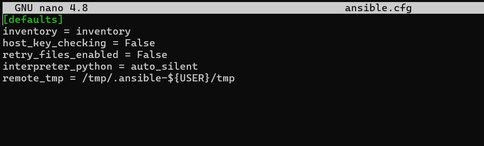

5. bikin file inventory

```bash
nano inventory
```

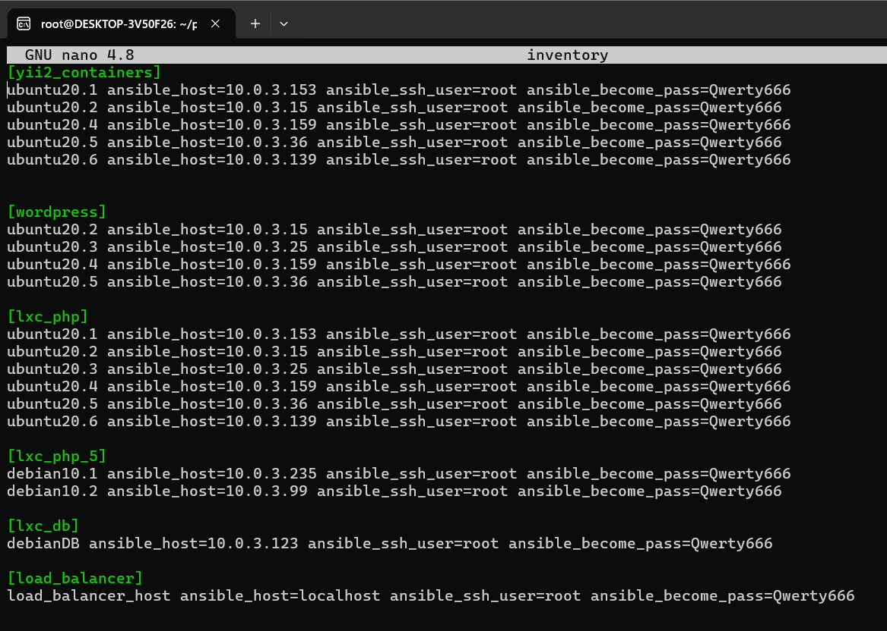

6. bikin folder dan file untuk konfigurasi ansible laravel

```bash
mkdir -p roles/laravel/task
nano roles/laravel/task/main.yml
```

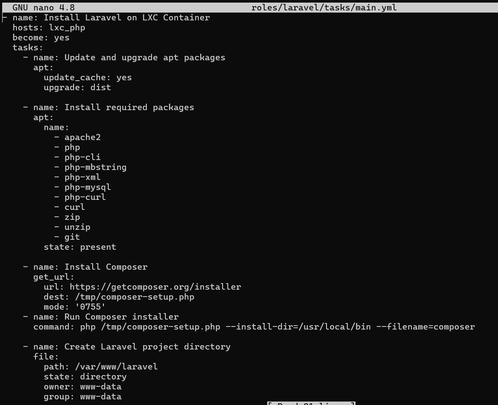

7. bikin folder dan file untuk konfigurasi ansible wordpress 

```bash
mkdir -p roles/wordpress/task
nano roles/wordpress/task/main.yml
```

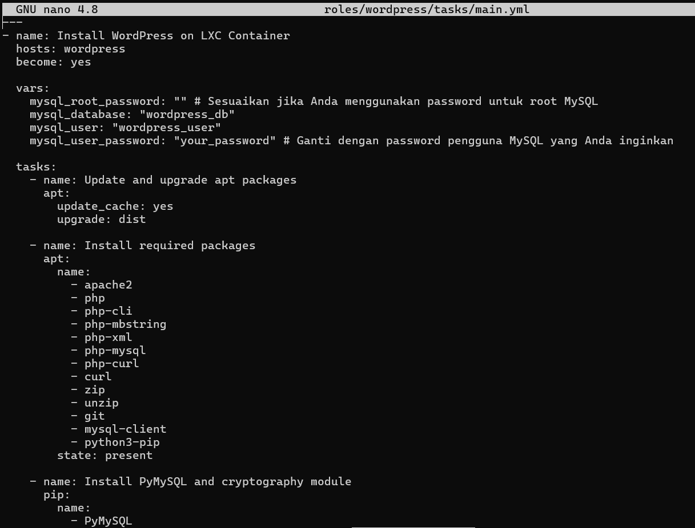

8. bikin folder dan file untuk konfigurasi ansible yii 

```bash
mkdir -p roles/yii/task
nano roles/yii/task/main.yml
```

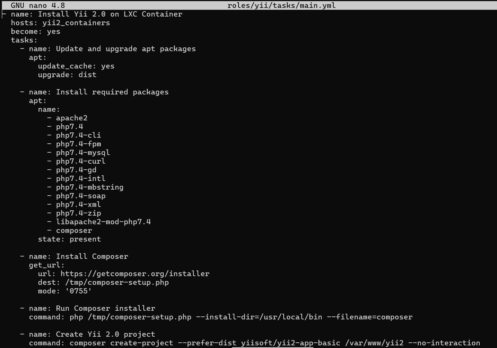

9. bikin folder dan file untuk konfigurasi ansible codeigniter 

```bash
mkdir -p roles/codeigniter/task
nano roles/codeigniter/task/main.yml
```

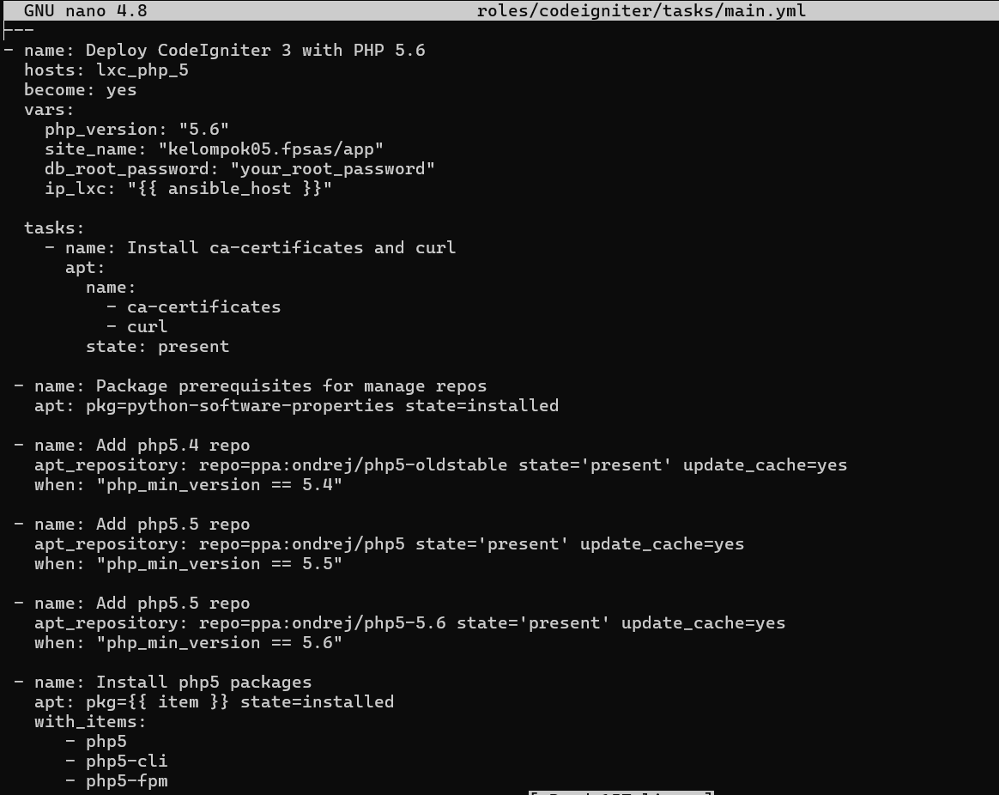

10. bikin folder dan file untuk konfigurasi ansible database

```bash
nano roles/db/task/main.yml
```

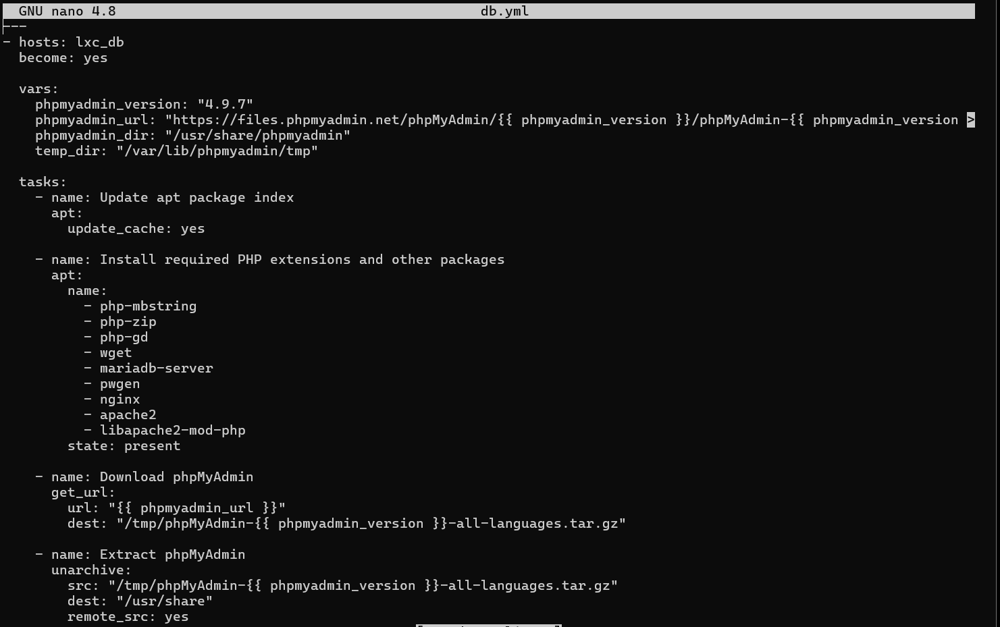

11. edit konfigurasi 

```bash
nano /etc/nginx/sites-available/default
```

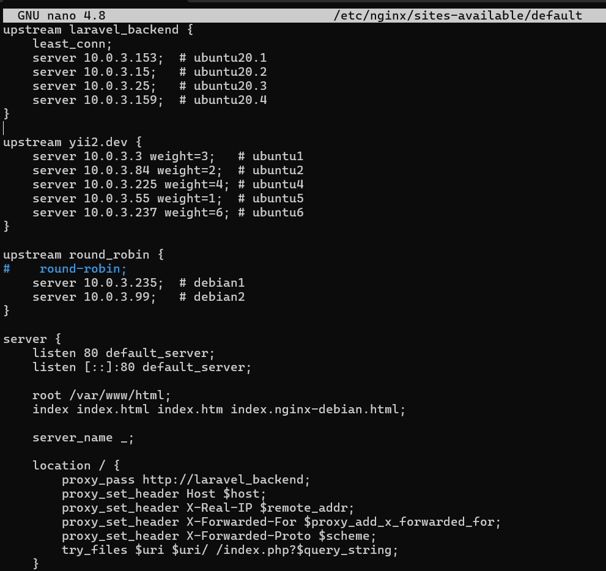
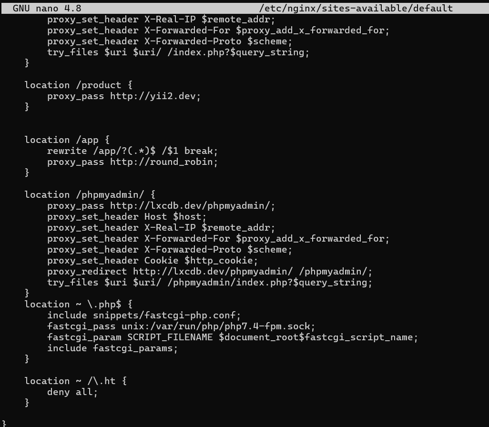

12. jalankan ansible untuk install laravel

```bash
ansible-playbook -i inventory roles/laravel/tasks/main.yml -k
```

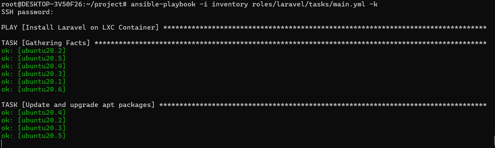

13. tampilan website laravel

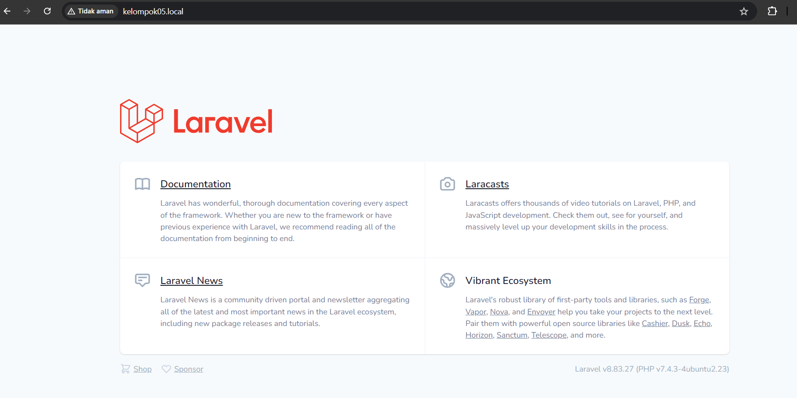

14. jalankan ansible untuk install codeigniter

```bash
ansible-playbook -i inventory roles/codeigniter/tasks/main.yml -k
```

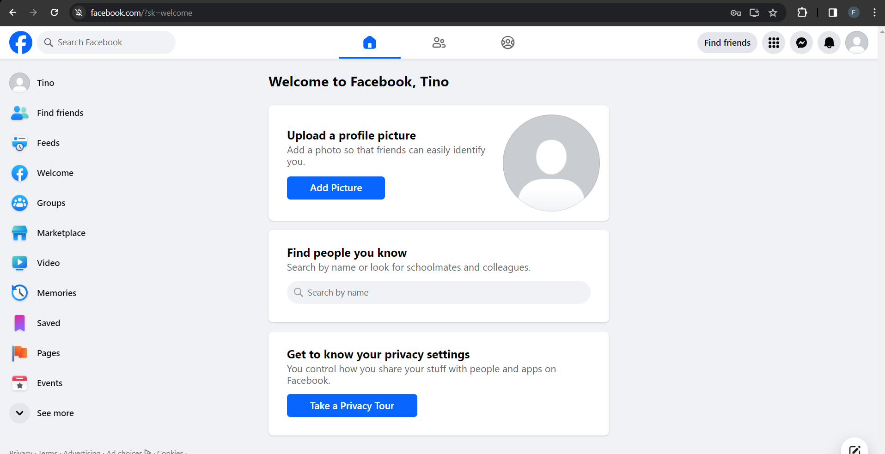

15. tampilan codeigniter

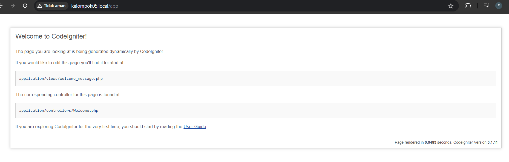

16. jalankan ansible untuk install yii

```bash
ansible-playbook -i inventory roles/yii/tasks/main.yml -k
```

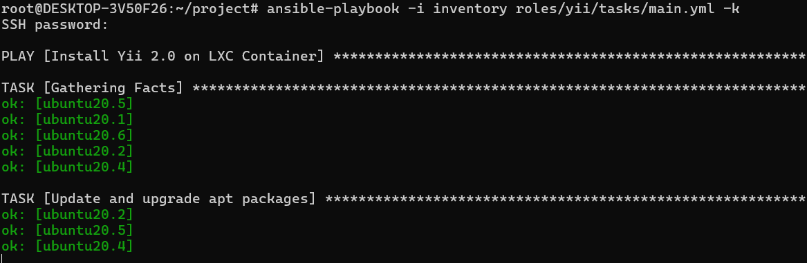

17. tampilan yii

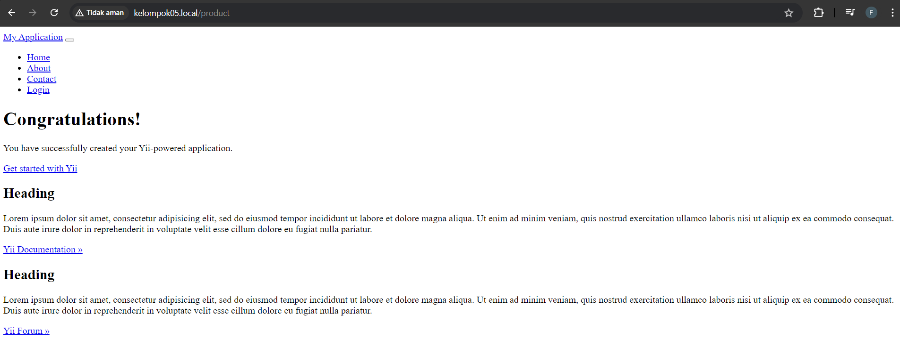

18. jalankan ansible untuk install wordpress

```bash
ansible-playbook -i inventory roles/wordpress/tasks/main.yml -k
```

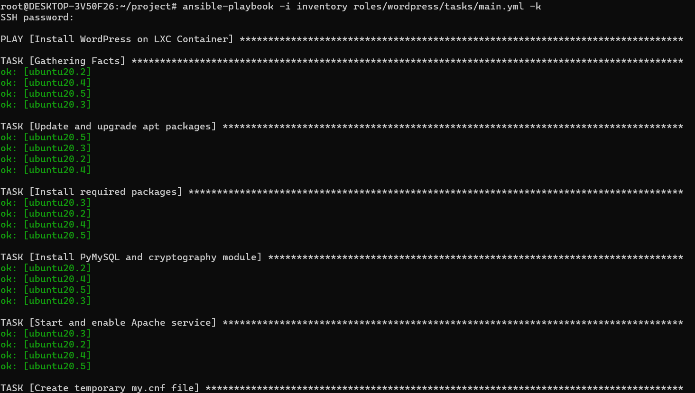

19. tampilan wordpress

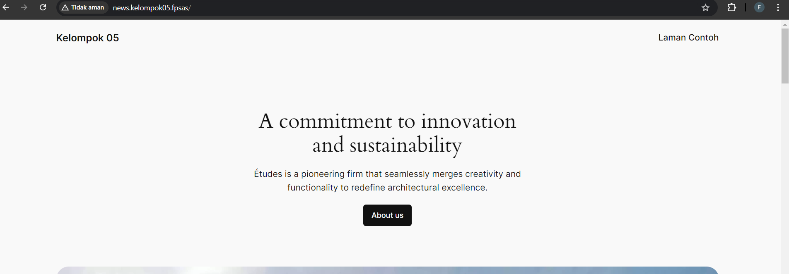


