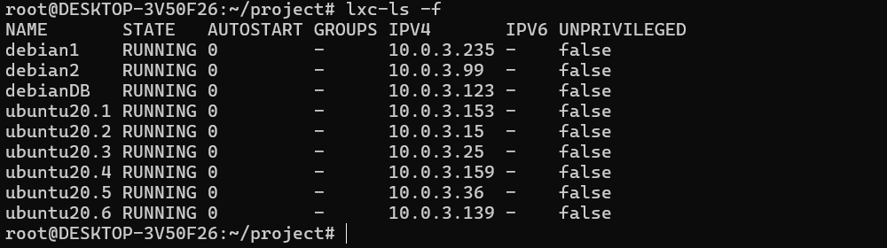

Nama Kemlompok : 05

Anggota Kelompok:
1. Fendi Virgainsyah
2. Firman Arief

kelas: IF 01-02

------
# FINAL PROJECT SISTEM TERDISTRIBUSI REPORT
------
# Step by Step

------

Scheme :


------

1.	buat LXC
```bash
lxc-create --name ubuntu20.1 --template download -- --dist "ubuntu" --release "focal" --arch amd64
```
```bash
lxc-create --name ubuntu20.2 --template download -- --dist "ubuntu" --release "focal" --arch amd64
```
```bash
lxc-create --name ubuntu20.3 --template download -- --dist "ubuntu" --release "focal" --arch amd64
```
```bash
lxc-create --name ubuntu20.4 --template download -- --dist "ubuntu" --release "focal" --arch amd64
```
```bash
lxc-create --name ubuntu20.5 --template download -- --dist "ubuntu" --release "focal" --arch amd64
```
```bash
lxc-create --name ubuntu20.6 --template download -- --dist "ubuntu" --release "focal" --arch amd64
```
```bash
lxc-create --name debian1 --template download -- --dist "debian" --release "buster" --arch amd64
```
```bash
lxc-create --name debian2 --template download -- --dist "debian" --release "buster" --arch amd64
```
```bash
lxc-create --name debianDB --template download -- --dist "debian" --release "buster" --arch amd64
```
