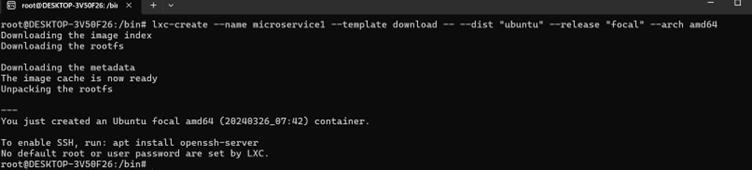
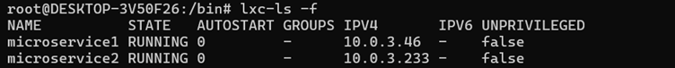
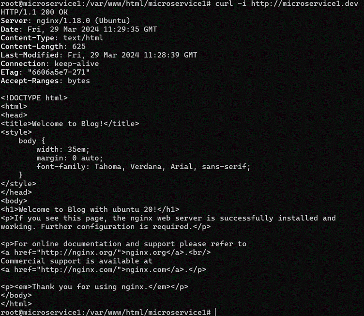

tugas virtualisasi web 

Nama : Fendi Virgainsyah

kelas: IF 01-02

NIM : 1203210086

1.	buat microservice 1
```bash
lxc-create --name microservice1 --template download -- --dist "ubuntu" --release "focal" --arch amd64
```


2.	buat microservice 2
```bash
lxc-create --name microservice2 --template download -- --dist "ubuntu" --release "focal" --arch amd64
```


3.	command # ip r -> untuk mengetahui ip dan subnet server dan microservice
```bash
ip r
```

```bash
lxc-ls -f
```


4.	masuk ke microservice1 dan microservice2 lalu install nginx dan network manager
```bash
lxc-attach -n microservice1
sudo apt install nginx nginx-extras
sudo apt install network-manager
```

```bash
exit
lxc-attach -n microservice2
sudo apt install nginx nginx-extras
sudo apt install network-manager 
```

```bash
exit
```

5.	setting static IP di microservice1
```bash
nano /etc/netplan/10-lxc.yaml
```

```bash
sudo netplan apply
ifconfig
```


6.	setting network interfaces
```bash
nano /etc/network/interfaces
```


7.	restart network manager
```bash
sudo systemctl restart NetworkManager
ifconfig
```


8.	Setting ngix
```bash
cd /etc/nginx/sites-available
touch microservice1.dev
nano microservice1.dev
```

```bash
cd ../sites-enabled 
ln -s /etc/nginx/sites-available/microservice1.dev . 
nginx -t 
nginx -s reload 
nano /etc/hosts
```

```bash
cd /var/www/html 
mkdir microservice1
cp index.nginx-debian.html microservice1/index.html 
cd microservice1
nano index.html
```


9.	Lakukan curl ke microservice1
```bash
curl -i http://microservice1.dev
```


10.	Setting Static IP microservice2
```bash
apt install nano net-tools curl 
sudo nano /etc/netplan/10-lxc.yaml 
```

```bash
sudo netplan apply 
ifconfig
```


Setting network interfaces
```bash
nano /etc/network/interfaces
```

```bash
sudo systemctl restart NetworkManager
ifconfig
```


Setting nginx
```bash
cd /etc/nginx/sites-available
touch microservice2.dev
nano microservice2.dev
```

```bash
cd ../sites-enabled
ln -s /etc/nginx/sites-available/microservice2.dev
nginx -t
nginx -s reload
nano /etc/hosts
```

```bash
cd /var/www/html 
mkdir microservice2 
cp index.nginx-debian.html microservice2/index.html 
cd microservice2
nano index.html
```

```bash
curl -i http://microservice2.dev
```


11.	Setting hosts di WSL 
```bash
nano /etc/hosts
```

```bash
cd /etc/nginx/sites-available
touch sister.local
nano sister.local
```

```bash
cd ../sites-enabled
sudo ln -s /etc/nginx/sites-available/sister.local .
sudo nginx -t
sudo nginx -s reload
```


Check apakah sudah ter-route dengan benar
```bash
curl -i http://sister.local
```

```bash
curl -i http://sister.local/blog
```

```bash
curl -i http://sister.local/aboutus
```

