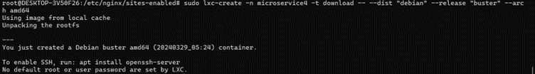
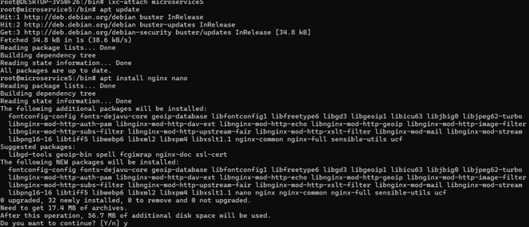

# Load Balancing dengan Round Robin

1.	Create microservice3
```bash
sudo lxc-create -n microservice3 -t download -- --dist "debian" --release "buster" –arch amd64
```

2.	Create microservice4
```bash
sudo lxc-create -n microservice4 -t download -- --dist "debian" --release "buster" –arch amd64
```

3.	Create microservice5
```bash
sudo lxc-create -n microservice5 -t download -- --dist "debian" --release "buster" –arch amd64
```

4.	Jalankan semua microservice yang telah di buat.
```bash
lxc-start -n microservice3
```
```bash
lxc-start -n microservice4
```
```bash
lxc-start -n microservice5
```


Konfigurasi microservice3
1.	Update dan Install nginx
```bash
lxc-attach microservice3
```
```bash
apt update
```
```bash
apt install nginx nano
```

```bash
nano /etc/hosts
```

#exitKonfigurasi microservice4
1.	Update dan Install nginx
```bash
apt update
```
```bash
apt install nginx nano
```

```bash
nano /etc/hosts
```

```bash
exit
```

Konfigurasi microservice5
2.	Update dan Install nginx
```bash
apt update
```
```bash
apt install nginx nano
```

```bash
nano /etc/hosts
```

```bash
exit
```
Konfigurasi Hosts wsl
```bash
nano /etc/hosts
```

```bash
sudo nano /etc/nginx/sites-available/sister.local
```

```bash
nginx -t	
```
```bash
nginx -s reload
```

```bash
curl -i app.sister.local
```

```bash
tail -f /var/log/nginx/app.sister.local-access.log
```
